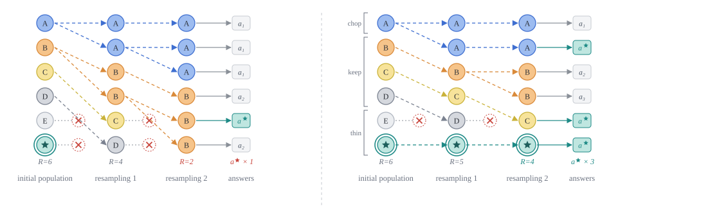
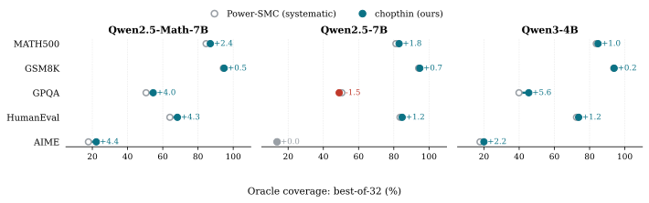

# Chopthin-Consensus Power Sampling (CCPS)

Code for *Chopthin-Consensus Power Sampling: A Diversity-Preserving Approach to LLM Decoding*, COLM 2026 Workshop on Efficient Reasoning.

<p align="center">
  
</p>

*Six particles, two resampling events. Circle size = weight, color = founding ancestor, ✕ = deleted, R = surviving lineages. **Left:** systematic resampling resets every weight to 1/N, deletes the low-weight ★ particle at the first event, and ends with 2 lineages and the wrong majority answer. **Right:** Chopthin keeps unequal weights within a bounded ratio, so ★ survives, 4 lineages remain, and the vote is correct.*

## What it does

Power sampling draws answers from a sharpened version of the base model, p(y | x)^α with α > 1, and recovers much of the gain of RL post-training without any training. Power-SMC runs it as sequential Monte Carlo: N particles decode in parallel and are resampled when their weights become uneven.

CCPS changes two things in that pipeline:

1. **Chopthin resampling** replaces systematic resampling. Instead of forcing all weights to be equal, it bounds the ratio between the largest and smallest weight by η, keeps light particles with probability proportional to their weight, and carries the unequal weights forward. It returns exactly N particles, is unbiased, and guarantees an ESS floor of about N/2 at η = 3+√8.
2. **Semantic-majority selection** replaces the final weight draw. Identical trajectories are merged, equivalent answers are clustered, and the answer supported by the most distinct trajectories is returned.

## Results

Chopthin raises oracle coverage (at least one of the 32 particles is correct) in 13 of 15 model–benchmark settings, and CCPS matches or beats Power-SMC's final-answer accuracy in 14 of 15. Full tables are in the paper.

<p align="center">
  
</p>

## Install

```bash
git clone https://github.com/MinooAhmadii/chopthin-consensus-power-sampling
cd chopthin-consensus-power-sampling
pip install -r requirements.txt
```

Python 3.10+ and one GPU with at least 48 GB for a 7B model at N = 32. Models download from Hugging Face on first run.

## Run

The defaults are the paper's settings: N = 32, α = 2, ESS trigger 0.5, block 64, α ramped over the first 100 tokens, up to 4096 new tokens, η = 3+√8.

```bash
# Power-SMC arm (systematic resampling)
python run.py --dataset math --model qwen_math --resampler systematic --seed 42 --out_dir runs/math/systematic

# Chopthin arm
python run.py --dataset math --model qwen_math --resampler chopthin --seed 42 --out_dir runs/math/chopthin
```

- `--dataset`: `math` (MATH500), `gsm8k`, `aime` (2022–2024), `gpqa` (Diamond), `humaneval`. The files are in `data/`.
- `--model`: `qwen_math` (Qwen2.5-Math-7B), `qwen` (Qwen2.5-7B), `qwen3` (Qwen3-4B), or any Hugging Face model id.
- `--problems`: `all` (default), a list `0,1,2`, or a range `0-99`.
- `--temperature` sets α = 1/temperature; 0.5 means α = 2.
- `--resampler chopthin_reset` is the ablation of Section 6.2 (Chopthin's offspring counts with the weights reset to 1/N).

Each run folder gets `per_run/p*.json` (all N particles: token ids, final weights, chosen index), `per_question.jsonl` (selected answer and outcome per problem), and `config.json` (every setting).

## Coverage and selection

```bash
# Oracle coverage and selected accuracy of two runs (paper Table 3)
python oracle_coverage.py --dataset math runs/math/systematic runs/math/chopthin

# HumanEval: behavior-majority selection without ground-truth tests
python he_gen_inputs.py qwen_math                                                       # the base model writes test inputs
python he_behavior_select.py --run runs/humaneval/chopthin --inputs he_inputs_qwen_math.json
```

The semantic-majority selector for the math and GPQA benchmarks is not in this repository yet.

`python figures/oracle_coverage.py` redraws the coverage figure above.

## Layout

| Path | What |
|---|---|
| `chopthin.py` | the Chopthin resampler (pure Python) |
| `smc.py` | SMC decoding loop; calls `chopthin()` when `--resampler chopthin` |
| `run.py` | entry point |
| `prompts.py` | prompt templates |
| `oracle_coverage.py` | oracle coverage of saved runs |
| `he_gen_inputs.py`, `he_behavior_select.py` | behavior-majority selector for code |
| `grader_utils/` | answer extraction and grading; HumanEval sandbox |
| `data/` | MATH500, GSM8K, AIME 2022–2024, GPQA Diamond, HumanEval |
| `figures/` | figure script and the images above |

## Citation

```bibtex
@inproceedings{ahmadi2026ccps,
  title     = {Chopthin-Consensus Power Sampling: A Diversity-Preserving Approach to LLM Decoding},
  author    = {Ahmadi, Minoo and Azizi, Seyedarmin and Baghaei Potraghloo, Erfan and Kamal, Mehdi and Pedram, Massoud},
  booktitle = {COLM 2026 Workshop on Efficient Reasoning},
  year      = {2026}
}
```

## Acknowledgments

The SMC decoding loop, KV-cache handling, graders, and benchmark files come from [Power-SMC](https://github.com/ArminAzizi98/Power-SMC) (Azizi, Baghaei Potraghloo, Ahmadi, Kundu, and Pedram, [arXiv:2602.10273](https://arxiv.org/abs/2602.10273)), which in turn builds on [Reasoning with Sampling](https://github.com/aakaran/reasoning-with-sampling) by Karan & Du. The Chopthin algorithm is from Gandy & Lau, *The chopthin algorithm for resampling*, IEEE Transactions on Signal Processing, 2016.
